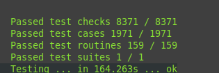

# How to start development

Explain how to start extending tests and the functionality of the module.

### Fork and clone

Use your github account to fork the repository `https://github.com/Wandalen/wFiles`.
After forking the repository clone it on your local machine. It looks like below:
```bash
git clone https://github.com/{{ your account }}/wFiles
cd wFiles
```

Further commands should be entered from the directory to which you've to cloned the repository.

### Prerequisites

You need utility willbe to build the project. To installl willbe use npm:
```bash
npm install -g willbe@delta
```

You need utility wTesting to test the project. To installl wTesting use npm:
```bash
npm install -g wTesting@delta
```

### Build

To build the project run

```bash
will .npm.intall
```

To check build was successful run tests.

### Run all tests

To run all tests use npm:

```bash
npm run test
```

Module::wFiles is sophisticated and the full run of all tests will take a while. To terminate the process of testing you may use `CTRL+C` combination, or leave it running in your current terminal and open a new one for other needs.

### Run a specific test suite

To run a specific test suite you may run it from NodeJs:

```bash
node proto/wtools/amid/l4_files.test/HardDrive.test.ss
```

You will see information about the process of testing and the report of testing after its completion. It looks like this:



### Run specific test routine

The test suite consists of test routines. To run a specific test routine use the option `routine`.

For example:

```bash
node proto/wtools/amid/l4_files.test/HardDrive.test.ss routine:readWriteBasic
```

Will run test routine `readWriteBasic`. But better combination of options for running specific test routine is:


```bash
node proto/wtools/amid/l4_files.test/HardDrive.test.ss verbosity:5 silencing:0 routine:readWriteBasic
```

Option `verbosity:5` increases the level of verbosity to `5`. Option `silencing:0` disable silencing of output which object of testing might generate, for example with routine `console.log()`.

### Source code of a test routine

Source code lives in the directory `proto`. You can search for what you are looking for in the directory and find it. For example, if you are interested to find the test routine `readWriteBasic` search for it and you will find out that test routine `readWriteBasic` is located in the file `proto/wtools/amid/l4_files.test/aFileProvider.test.s`.

### Structure of a test routine

Let's look on the structure of the test routine `readWriteBasic`:

```js
function readWriteBasic( test )
{
  let context = this;
  let a = context.assetFor( test, false );

  /* */

  test.case = 'args array';
  a.reflect();
  var data = 'data1';
  var filePath = a.abs( 'file1.txt' );
  a.fileProvider.fileWrite( filePath, data );
  var got = a.fileProvider.fileRead( filePath );
  test.identical( got, data );

  /* */

  test.case = 'options map';
  a.reflect();
  var data = 'data1';
  var filePath = a.abs( 'file1.txt' );
  a.fileProvider.fileWrite({ filePath, data });
  var got = a.fileProvider.fileRead( filePath );
  test.identical( got, data );

  /* */

}
```

You can see 2 test cases: `args array` and `options map`. The first case covers basic writing and reading of the file `file1.txt` as well as the second, but the second uses options-map instead of arguments-array to write the file.

```js
let a = context.assetFor( test, false );
```
Above code initializes the test asset and does the preparation required for the test routine.

```js
test.case = 'args array';
```
Above code starts a new test case naming it.

```js
test.case = 'a.reflect()';
```
Above code creates a temp directory and copies associated with the test routine test files if such exists.

```js
var filePath = a.abs( 'file1.txt' );
```
Above code returns the absolute path to the file which is going to be created.

```js
a.fileProvider.fileWrite( {filePath, data} );
```
Above code writes the file `file1.txt` into the temp directory with the content of variable data.

```js
var got = a.fileProvider.fileRead( filePath );
```
Above code read the file `file1.txt` into variable `got`.

```js
test.identical( got, data );
```
Above code checks if the contents of variable data and content of file are identical.

### The first task

As the first step you may extend test routine `readWriteOptionWriteMode`. Each routine cover a specific aspect of a unit. Test routines `readWrite*` covers reading/writing cycle. Test routine `readWriteOptionWriteMode` covers option `writeMode` of the `fileWrite`. Option `writeMode` may have several value. Default value of `writeMode` is `rewriting`. Please extend test routine `readWriteOptionWriteMode`.

### Commit and push

After extending a test routine please commit and push your changes to your fork.

### Open pull request

After pushing your changes open pull request to the original repository from your fork. Hopefully, you have no problem with those steps, but if you do you can consult [documentation of the github](https://docs.github.com/en/github/collaborating-with-issues-and-pull-requests/creating-a-pull-request-from-a-fork).

After opening a PR visit github to see how it looks and double-check its diff. Your PR should have only changes related to the problem you have been solving. Your code should follow the code of convention and be written in the style of the rest project.

### Ask questions

During the process, you will come up with questions which you can ask. If you noticed a typo or a problem in the file, please let us know.
