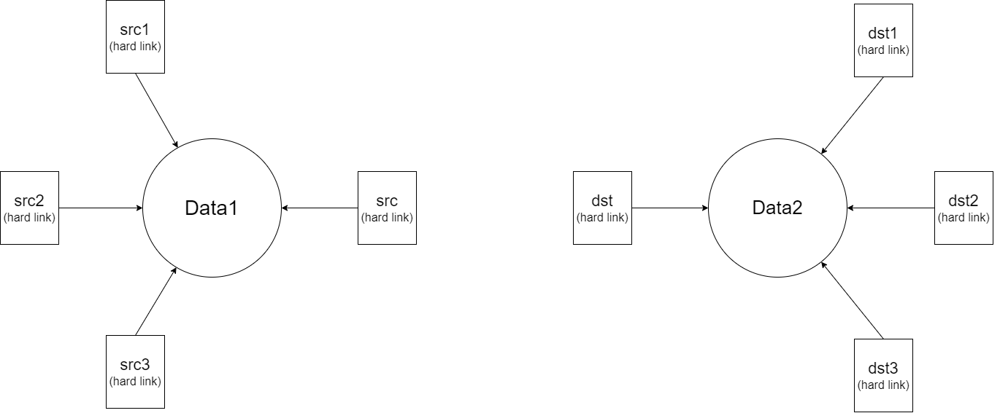
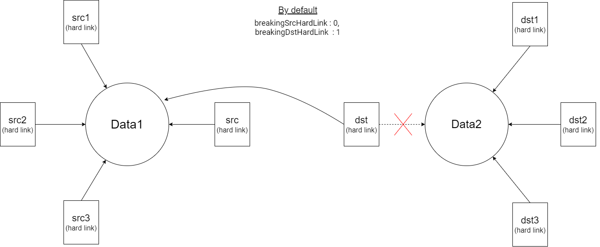
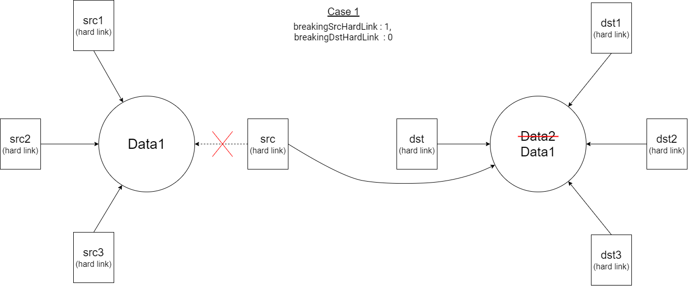
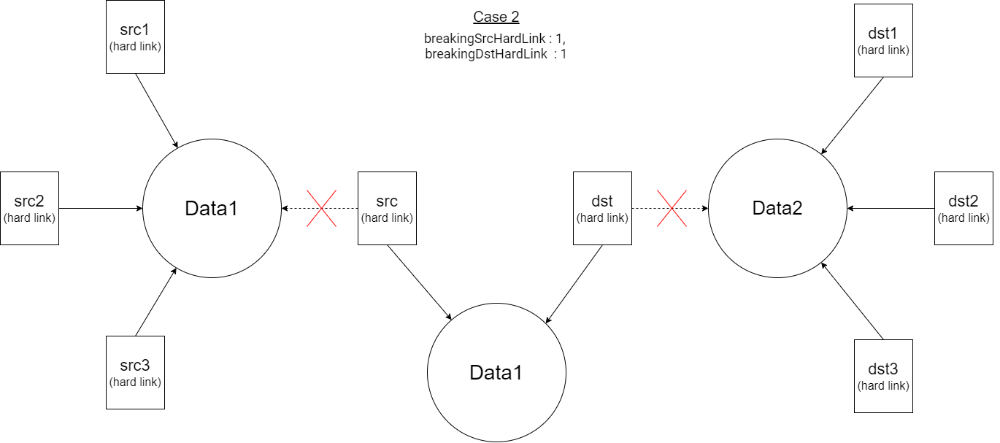

# Базове використання `hardLink`

Використання базових можливостей методу <code>hardLink</code>.

Нехай маємо таку структуру файлів у файловій системі.

У випадку створення хард лінка із опціями за замовчуванням відбудуться наступні зміни:

Файл dst стає хард лінком файла з даними Data1.

У випадку створення хард лінка із опціями breakingSrcHardLink:1 та breakingDstHardLink:0, отримаємо: 

Тобто не лише src стає хард лінком файла на котрий вказував і далі продовжує вказувати хард лінк dst, але й відбувається копіювання даних Data1. Дані Data2 видалені.

Якщо ж встановити опції breakingSrcHardLink:1, breakingDstHardLink:1, отримаємо:

У цьому разі створюється новий файл на котрий вказують хард лінк src та dst. Дані у цей файл копіюються із файлу на який раніше вказував src.

Створення хард лінка з опціями breakingSrcHardLink:0, breakingDstHardLink:0 є забороненим.
